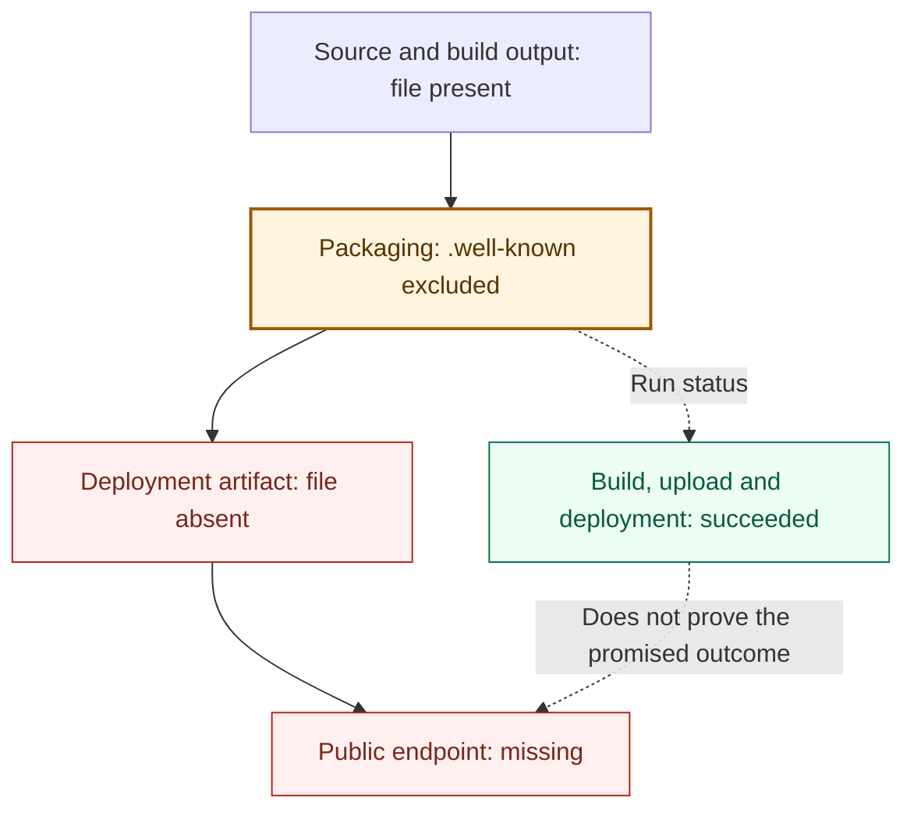

# Adopting the Playbook into an existing project

Adoption starts with one real change and the systems the project already uses. You do not need to install software, copy a template, or create a Playbook-specific tracker before the protocol can be useful.

Read [`../ACCEPTANCE.md`](../ACCEPTANCE.md) alongside one identifiable proposed change. Ask what result is being promised, which exact revision is being judged, what that change requires, which evidence and judgment support it, who or what policy can accept it, and what must be true before the work is complete.

## Worked example: green deployment, missing endpoint

**The promise was a working public URL. The evidence established a successful workflow. Those were different claims.**

A [real change](https://github.com/manjast/personal-page/commit/720a3efc15d53c40eac6c87e014fb9bf92caf6c7) added `public/.well-known/security.txt` to a site. Its [build, artifact upload, and deployment all succeeded](https://github.com/manjast/personal-page/actions/runs/33065897853). But the artifact action excluded hidden directories, including `.well-known`. The [revert records the omission](https://github.com/manjast/personal-page/commit/6ed376695b70a8941bacd2598d23231a3ca45b68); the repair [enabled hidden-file inclusion](https://github.com/manjast/personal-page/commit/aef22ffb1f825d258560d6add41f2df5ed700a11) before [republishing the file](https://github.com/manjast/personal-page/commit/36f8fae460f8517d4fc51c142630bb46d49b20d7).



Solid arrows track the published content; dotted arrows show execution status and its limit. **Repair:** enable hidden-file inclusion, then inspect the archive for unintended additions.

This retrospective walkthrough shows how the protocol changes the decisions around that failure. The roles and checks below are illustrative project choices, not claims about the historical approval process or additional Playbook requirements.

### Make the promised result explicit

The historical commit named the intended public endpoint, but it did not record this full contract. For this retrospective walkthrough, make the work contract explicit:

> Publish the site owner's agreed security-contact content at `https://example.test/.well-known/security.txt`. Success means that URL serves the agreed content with HTTP 200 and a `text/plain` media type. Scope includes content and publication configuration. The work is complete after the published response is confirmed.

`example.test` is a placeholder for the project's actual domain. The site owner supplies the content; the agent does not invent a contact address or weaken the promised outcome.

The project already authorizes a maintainer to approve workflow changes and merge, and its deployment policy to publish accepted changes. The agent can edit and run checks; production credentials remain with the deployment system. No new Playbook record is needed.

### Decide what each boundary needs

For this replay, assume the project accepts the change through a pull request. The candidate is that PR's current revision, including both content and packaging, evaluated against its relevant target context.

| Decision | What supports it in this project? | Where it lives |
|---|---|---|
| Accept for merge | Required checks pass for this candidate/context; the actual packaging path preserves the agreed file; the maintainer judges the workflow change and newly included files acceptable. | PR, CI results, review and effective merge policy |
| Publish | Deployment is authorized for the accepted change. Publish the checked artifact, or validate the rebuilt artifact before publishing. | Deployment policy, run, artifact and revision association |
| Call the work complete | A deployment associated with the accepted change has occurred, and the production URL serves the agreed response. | Deployment record and endpoint observation linked from the existing work item |

Production confirmation is a downstream obligation here. It is not a prerequisite that the new endpoint already work before its implementation can merge.

### Check what will actually ship

The [pinned artifact action](https://github.com/actions/upload-pages-artifact/blob/fc324d3547104276b827a68afc52ff2a11cc49c9/action.yml) defaulted to excluding hidden files and directories. Therefore a correct source file—and even a correct file in `dist/`—could disappear during packaging while the archive command succeeded.

The historical repair was:

```yaml
# In the existing upload-pages-artifact step:
with:
  path: ./dist
  include-hidden-files: true
```

For this project, make archive validation part of the evidence required before merge: inspect the output of the packaging path actually used for publication, and compare the included file with the agreed content. In the original workflow, artifact upload ran only on pushes to `main`; an unrelated green PR build did not establish this property. For this replay, that means exercising the materially relevant packaging behavior—or an equivalent candidate-bound validation—on the proposed revision before relying on it for merge. The relevant packaging validation must execute at the boundary where the project relies on it. A skipped or missing run supplies no such evidence.

The fix also broadens publication: a `.env` accidentally present in `dist/` could now be included. Inspect what the archive contains and resolve unintended additions. A directory called `dist` is not proof that everything inside it is safe to publish.

Refresh packaging evidence and judgment about the workflow and publication scope. Earlier content review can remain applicable if its content, intent and context remain unchanged; do not automatically discard every prior result.

### Confirm the promised result

After the authorized deployment, request the production URL and check the agreed response. HTTP 200 alone is insufficient: a home-page fallback or older content can also return 200. Conversely, matching content alone does not establish which revision was deployed; retain the deployment-to-candidate association.

If the response is missing or wrong, report the failed outcome and use the project's remediation policy. If production confirmation is unavailable, report “deployed; endpoint confirmation pending.” Neither state supports “complete.”

### Challenge a tempting shortcut

Suppose the agent replaces the archive check with “the source file exists.” The original broken candidate now passes, but the publication obligation remains unsatisfied. A useful challenge is to run the proposed check against the known-bad artifact: does it still catch the omission? The changed check needs validation and appropriate authority; its own green result does not authorize lowering the bar.

**What did adoption add?** A check at the actual packaging boundary, appropriate judgment of a workflow change, and confirmation of the promised result. The issue, PR, CI and deployment system continue to own their facts. For work whose agreed endpoint is incorporation—such as an internal refactor—merge with the required evidence may already be sufficient.

The general adoption steps below apply the same questions without requiring this project's particular controls.

## 1. Start with the authoritative work source

Use the system that already owns the intent and work state: an issue, specification, Jira/Linear item, `TASKS.md`, or another maintained source.

The next bounded change should expose enough information to determine:

- the intended observable outcome;
- material scope and exclusions;
- how success can be established;
- relevant authoritative constraints and durable decisions;
- consequential unresolved questions or stop conditions;
- the authority relevant to execution and acceptance;
- when the promise extends beyond incorporation, the downstream outcome that must be established before calling the work complete.

Do not create a second tracker or specification merely to satisfy the Playbook.

## 2. Identify the candidate and boundary

Choose how the proposed change is identified in this project: commonly a pull request and current revision, or an exact commit/range in another workflow.

Also identify the boundary the decision addresses: merge, release, deployment, or another project-defined transition.

Use normal local verification for fast feedback. For claims that must hold at incorporation or another authoritative boundary, rely on evidence valid for the candidate and context at that boundary.

The Playbook does not require one task to equal one commit or Git-derived hashes to be copied into tracked completion ledgers.

## 3. Inspect evidence, judgment, obligations, and authority

For the candidate and boundary under consideration, determine where the project already establishes:

- mechanical evidence relevant to the candidate;
- any additional obligations triggered by the change or project policy;
- judgment that cannot be reduced safely to mechanical checks;
- execution permissions governing what an agent or other actor may do while producing the work;
- acceptance authority governing who or what policy may permit the change to cross the boundary.

Additional obligations should be selective. Project-recognized dependency manifests, CI or policy controls, deployment configuration, migration/schema locations, declared impact, architecture decisions, and known failure models may all be useful sources. They are examples, not a universal trigger catalogue.

Independent challenge review can be useful when residual uncertainty is dominated by missing invariants, weak test oracles, semantic or provenance mistakes, or producer self-confirmation. It is not required for every candidate.

If the candidate changes a control used to judge it, such as a test workflow, permission boundary, or acceptance policy, validate and authorize that control change appropriately rather than allowing the candidate to lower its own bar silently.

## 4. Refresh only what stopped applying

Candidate content, integration context, or authoritative intent can change during implementation and review.

Do not assume every change invalidates every prior result. Re-evaluate the evidence, judgment, or approval whose applicability was materially affected, and refresh what no longer supports the candidate and context being accepted.

Likewise, missing, skipped, stale, superseded, or materially inapplicable evidence should not be represented as passing evidence.

## 5. Name the completion boundary truthfully

Acceptance and completion are not always the same event.

```text
accepted for incorporation
!= incorporated

incorporated
!= deployed or released

deployed
!= confirmed in effect
```

The work contract should make clear which terminal outcome the promise actually requires. Claim only the strongest state for which current evidence exists.

## Add repository guidance only when it earns its place

An instruction file such as `AGENTS.md` helps when recurring agent work needs durable, non-obvious guidance about authoritative sources, verification entry points, execution limits, stop conditions, or escalation.

If that need exists, adapt [`../templates/AGENTS.md`](../templates/AGENTS.md) or improve the project's existing repository instructions. If another tool expects a different filename, prefer a short pointer where practical rather than duplicating policy.

No Playbook-specific instruction file is necessary when the project's existing work system, repository guidance, checks, review policy, permissions, and deployment evidence already express the needed semantics.

Other optional artifacts may still be useful when they contain unique information:

- `DECISIONS.md` or ADRs for rationale not recoverable from the diff;
- `TASKS.md` for repositories that genuinely need an in-repo work tracker;
- project-specific quality or acceptance policy grounded in real constraints or failure history;
- records of where evaluation inputs and results came from and how results were produced, when the deliverable is an empirical or probabilistic result rather than ordinary software behavior.

## Migrating from v1

v2 retires the Playbook's old enforcement and bookkeeping adoption model. New projects should not install the legacy `enforcement/` stack, post-commit completion bookkeeping, verifier/executor, structural conformance harness, or one-task-one-commit/task→commit ledger as Playbook requirements.

For an existing v1 adoption, retire dependencies on those mechanisms deliberately. Do **not** delete useful tests, review rules, decision history, permissions, or project-specific controls merely because the Playbook no longer supplies or requires the old machinery. First determine which local property each integration protects, then keep, replace, or remove it on its own merits.

Historical implementations remain available through Git history and v1 releases.

## Current scope

The maintained adoption surface is intentionally narrow. The Playbook does not currently supply a universal GitHub configuration, broad trigger catalogue, standalone reviewer framework, multi-vendor recipe set, or generic acceptance checker.

Add platform-specific guidance only when repeated real use demonstrates a concrete need that existing systems and the normative protocol do not already explain clearly.